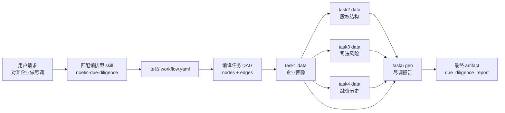
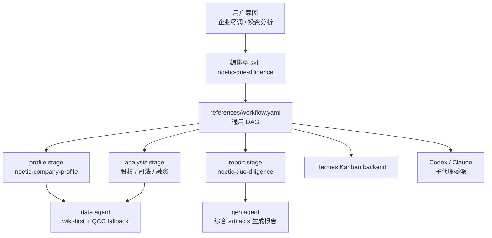
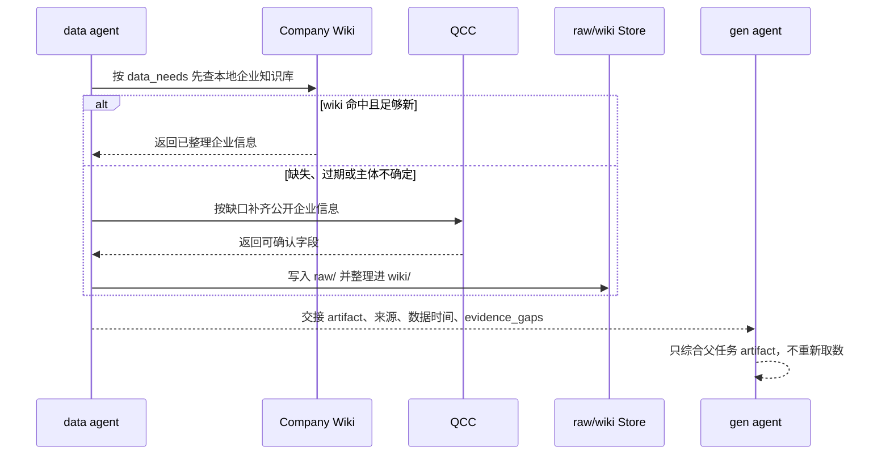

# NoeticAI Knowledge 插件化结论

> 日期：2026-07-03
> 范围：`noeticai-knowledge` 作为多宿主 skills 插件的结构、workflow、agent role skill 分工与企业数据策略。

## 结论摘要

`noeticai-knowledge` 应按 skills-first 插件组织，不做成传统应用服务或独立 workflow runtime。

- `skills/*/SKILL.md` 是跨宿主可发现入口。
- 知识卡片保持独立 skill；需要标准前置流程时，由编排型 skill 的 `references/workflow.yaml` 声明 DAG。
- `workflow.yaml` 只描述 stage、skills、inputs、outputs、parallel 等通用编排语义，不绑定 Hermes。
- 执行层再把 workflow 映射到 agent：Hermes 不指定 profile，使用默认 agent 承接 Kanban task，用 role skill 区分 data/gen；Codex、Claude 等宿主可用委派子代理模式按 DAG 节点执行。
- 企业数据访问由 data agent 统一控制 wiki-first、QCC fallback 和 raw/wiki 写回；业务 skill 只描述业务产物和质量要求。
- gen agent 只综合前置 artifact 生成最终报告，不重新取数、不补造缺失事实。

当前仓库只保留插件契约、skill 说明、workflow 描述和静态校验。Hermes Kanban 是试行 backend，不是通用插件契约的一部分。

## 插件结构

核心目录保持简单：

```text
skills/
  noetic-company-profile/
    SKILL.md
    card.yaml
  noetic-due-diligence/
    SKILL.md
    card.yaml
    references/
      workflow.yaml
```

宿主入口只做发现与注册：

- `.codex-plugin/plugin.json`：Codex manifest。
- `.claude-plugin/plugin.json`：Claude 兼容 manifest。
- `plugin.yaml`、`__init__.py`：Hermes plugin shell，动态注册 `skills/*/SKILL.md`。
- `scripts/validate_work_suite.py`：校验 manifest、skills、workflow 引用和静态契约。

放弃顶层 `workflows/` 作为用户入口。跨宿主可见的是 skill；workflow 是编排型 skill 的内部 SOP。

## Workflow 与 Agent 分工

`workflow.yaml` 制定的是通用 DAG。执行时再由宿主决定如何跑：

| 层级 | 职责 | 示例 |
| --- | --- | --- |
| Skill | 声明单张知识卡片或最终报告能力 | `noetic-company-profile`、`noetic-due-diligence` |
| Workflow | 声明前置 stage、artifact 输入输出和并行关系 | `skills/noetic-due-diligence/references/workflow.yaml` |
| Agent / Role Skill | 执行 DAG 节点或角色 | 默认 agent、`noetic-data-agent`、`noetic-gen-agent` |
| Backend | 提供具体任务执行方式 | Hermes Kanban、Codex 子代理委派、Claude 子代理委派 |

首版只需要 Hermes 默认 agent 和两个 role skill：

| Profile / Agent | 执行什么 | 不做什么 |
| --- | --- | --- |
| 默认 agent | Hermes Kanban 的通用运行身份，负责接收 task 并加载 NoeticAI Knowledge 套件 | 不表达 data/gen 业务角色 |
| `noetic-data-agent` role skill | 企业画像、股权结构、司法风险、融资历史等前置知识卡片；负责 wiki-first、QCC fallback、raw/wiki 写回和 `evidence_gaps` | 不生成最终尽调/投分报告，不把缺失字段写成确定结论 |
| `noetic-gen-agent` role skill | 企业尽调、投资分析等编排型报告卡片；只综合父任务 artifact | 不重新取数，不绕过父任务数据缺口补事实 |

Hermes planned task 不传 `--assignee`；`data` / `gen` 是 workflow role，通过 `noetic-data-agent` / `noetic-gen-agent` role skill 表达。

## 跨宿主兼容

`workflow.yaml` 不包含 Hermes Kanban 字段，因此可以被不同宿主解释：

- Hermes：`workflow.yaml -> task DAG -> Kanban task`，planned 节点不指定 assignee，前置节点带 `noetic-data-agent`，报告节点带 `noetic-gen-agent`。
- Codex/Claude：`workflow.yaml -> JSON DAG -> 子代理委派`，每个节点拿到对应 skill、输入 artifact 和输出 artifact。
- 无子代理宿主：当前 agent 可按 DAG 拓扑顺序执行；`parallel: true` 只是提示可并发，不是必需能力。

这个边界避免把 Hermes 试行 backend 写进普通业务 skill。需要状态沉淀、持久重试或无人值守执行时，可以选择 Hermes Kanban；只需要跨宿主预览和执行时，用子代理委派即可。

## 任务编排结构

`/noetic-workflow` 把编排型 skill 的 `workflow.yaml` 转成任务 DAG。DAG 节点不是新的业务类型，而是一次 skill 执行：

| DAG 字段 | 来源 | 含义 |
| --- | --- | --- |
| `node.id` | 编译时生成 | 本次 workflow 内的临时任务编号，如 `task1` |
| `node.stage` | `stages[].id` | 业务阶段，如 `profile`、`analysis`、`report` |
| `node.skill` | `stages[].skills[]` | 该节点要执行的 skill |
| `node.role` / `role_skill` | stage 与 entry skill 推导 | `role` 表达 data/gen；`role_skill` 是 `noetic-data-agent` 或 `noetic-gen-agent` |
| `node.outputs` | `stages[].outputs[]` | 节点交付的 artifact |
| `edges[]` | `stages[].inputs[]` 与 stage 顺序 | artifact 依赖与任务父子关系 |

编排规则保持最小：

- `inputs` 指向已经由前置节点产出的 artifact。
- `outputs` 是下游可消费的 artifact 名称。
- `parallel: true` 表示同一 stage 的多个 skill 可并行执行。
- `report` stage 或编排型 skill 本身默认交给 gen agent，其余节点交给 data agent。

企业尽调会被编译成 5 个任务节点：

```text
task1: data noetic-company-profile -> company_profile
task2: data noetic-shareholder-structure <- company_profile -> shareholder_structure
task3: data noetic-litigation-risk <- company_profile -> litigation_risk
task4: data noetic-financing-history <- company_profile -> financing_history
task5: gen  noetic-due-diligence <- company_profile + shareholder_structure + litigation_risk + financing_history
```

### 编排流程示例



### 执行模式比较

| 模式 | 命令形态 | 编排来源 | 输出/副作用 | 适用场景 |
| --- | --- | --- | --- | --- |
| `compile` | `noetic_workflow.py compile` | `workflow.yaml` | 打印 DAG JSON，不调用 Hermes | 检查 nodes/edges、调试任务拓扑 |
| `delegate` | `execute --mode delegate` | `workflow.yaml` | 打印可委派 JSON DAG，不创建任务 | 默认跨宿主模式；Codex、Claude 等可按节点委派子代理 |
| `planned` | `execute --mode planned --dry-run|--apply` | `workflow.yaml` | dry-run 打印 Kanban create 命令；apply 创建 Hermes Kanban task | Hermes 内跑标准尽调/投分，需要状态沉淀和 parent 依赖 |
| `auto` | `execute --mode auto --apply` | Hermes triage/decomposer | 创建一条 triage task，由 Hermes 自动拆图 | 粗粒度探索式需求；不保证严格等同 `workflow.yaml` |

跨宿主预览或无 Hermes 环境时优先 `delegate`，因为它只依赖通用 DAG。Noetic agent 任务实际跑在 Hermes 时，优先使用 `planned` 作为标准执行 backend；`auto` 是 Hermes 探索式拆解，不作为业务 SOP 的唯一依据。

### Hermes Kanban 与 LangGraph 对比

当前前提是 Noetic agent 任务实际跑在 Hermes。对比重点不是“是否需要 graph”，而是谁来承接任务生命周期、默认 agent 调度、日志、状态和人工接管。

| 维度 | Hermes Kanban | LangGraph |
| --- | --- | --- |
| 执行位置 | Hermes 原生 task，由默认 agent 执行，role skill 约束职责 | 需要额外把 graph node 映射回 Hermes task |
| 多 agent 分工 | role skill、业务 skill、parent 依赖都是 Hermes 可见对象 | node 只是应用内函数或 runnable，agent 身份要另建适配层 |
| 状态与日志 | task status、parent、log、dispatch 在同一套 Hermes board 中 | graph state 与 Hermes task state 容易变成两套真相 |
| 插件分发 | 插件只提交 Kanban task，保持轻量 | 插件需引入 LangGraph 依赖和 checkpoint/store 策略 |
| 可复现 DAG | `workflow.yaml -> kanban create --parent` 已覆盖标准尽调/投分 | 可以表达更复杂状态机，但当前标准 DAG 用不上 |
| 暂停/恢复 | 依赖 Hermes task 生命周期和人工接管 | LangGraph 擅长持久化、interrupt 和 human-in-the-loop，但需要独立 runtime |
| 适用边界 | Hermes 内运行 Noetic workflow 的主 backend | Hermes dispatcher 内部实现，或未来 Noetic 服务端 runtime |

LangGraph 官方定位是 agent orchestration runtime，重点能力包括 durable execution、streaming、human-in-the-loop 和 persistence；这些能力适合应用后端，但放进插件会带来 checkpoint/store、thread_id、恢复语义和观测面重复的问题。参考：[LangGraph overview](https://docs.langchain.com/oss/python/langgraph/overview)、[Persistence](https://docs.langchain.com/oss/python/langgraph/persistence)。

建议：

- Hermes 场景主链继续使用 Kanban：`workflow.yaml -> DAG -> hermes kanban create --parent -> 默认 agent execute`。
- LangGraph 不作为插件对外依赖，也不替代 Kanban task lifecycle。
- 如果未来需要动态循环、审批中断、跨天恢复，可以在 Hermes dispatcher 或 Noetic 服务端内部试 LangGraph；插件仍只面向 Hermes Kanban contract。
- 不做 `Noetic plugin -> LangGraph -> Hermes Kanban` 这种双调度链，除非 Kanban 无法表达真实业务状态。

## 企业数据策略

之前尝试用 skills 文案约束 wiki/QCC 策略，稳定性不够：不同 business skill 容易重复或漏写数据源规则，也容易误绑定具体 MCP 工具名。

当前策略收敛到 data agent：

- 默认先查用户本地企业知识库：`~/.noeticai/company-knowledge`。
- 可用 `NOETICAI_COMPANY_KB_DIR` 覆盖知识库目录。
- 只有 wiki 无命中、字段缺失、主体不确定或信息明显过期时，才调用 QCC 等公开企业信息源。
- 补齐后写入 `raw/`，再整理进 `wiki/`。
- 输出必须包含来源、数据时间、wiki 写回状态和 `evidence_gaps`。

business skill 不需要描述具体数据源控制策略，只需要声明业务输入、`data_needs`、输出 artifact 和质量约束。数据访问、写回和缺口标注由 `noetic-data-agent` role skill 和任务模板统一执行。

Hermes manifest 中 QCC 仍按强依赖声明：

- `requires_env` 声明 `QCC_MCP_TOKEN`（`hermes plugins install` 时写入 `~/.hermes/.env`）。
- `plugin.yaml` 的 `mcp_servers` 使用 `${QCC_MCP_TOKEN}` 做 bearer auth。
- Hermes 不读 `.mcp.json`；插件 `register()` 会把 `mcp_servers` 幂等合并进 `~/.hermes/config.yaml`。
- 仓库不提交真实 token、企业数据或用户本地 wiki。

## 示例 1：原子 Skill

`skills/noetic-company-profile/card.yaml` 把企业画像定义为独立知识卡片：

```yaml
id: noetic-company-profile
name: 企业画像
description: 汇总目标企业基本信息、经营状态、行业定位与核心标签。

inputs:
  - company_name
  - unified_social_credit_code

data_needs:
  - 企业工商基本信息
  - 所属行业与主营业务
  - 企业规模信号
  - 近期经营异常、行政处罚等公开记录

outputs:
  - company_summary
  - industry_position
  - operating_status
  - key_tags
  - risk_flags
  - company_wiki_writeback_status
  - evidence_gaps
```

这个 skill 只声明业务能力和产物形态。是否查 wiki、何时查 QCC、如何写回 raw/wiki，由 data agent 统一控制。

## 示例 2：编排型 Skill

`skills/noetic-due-diligence/references/workflow.yaml` 声明企业尽调的前置 DAG：

```yaml
name: 企业尽调
stages:
  - id: profile
    skills: [noetic-company-profile]
    outputs: [company_profile]

  - id: analysis
    skills: [noetic-shareholder-structure, noetic-litigation-risk, noetic-financing-history]
    inputs: [company_profile]
    parallel: true
    outputs: [shareholder_structure, litigation_risk, financing_history]

  - id: report
    skills: [noetic-due-diligence]
    inputs: [company_profile, shareholder_structure, litigation_risk, financing_history]
    outputs: [due_diligence_report]
```

执行时，`profile` 和 `analysis` stage 交给 data agent，`report` stage 交给 gen agent。Codex 等宿主可以把这些节点委派给子代理；Hermes 可以把这些节点创建为 Kanban task。

## 图示

### Skills / Workflow / Agent



### 企业数据流



## 已落地与边界

已落地：

- 多宿主 manifest：`.codex-plugin/plugin.json`、`.claude-plugin/plugin.json`、`plugin.yaml`。
- Hermes 注册入口：`__init__.py` 扫描并注册 `skills/*/SKILL.md`。
- 静态校验：`scripts/validate_work_suite.py --target all .`。
- 编排 workflow 位于编排型 skill 的 `references/workflow.yaml`。
- `/noetic-workflow` 可把 workflow 编译为 DAG，并支持 Hermes Kanban 或宿主子代理委派。

暂不纳入：

- 独立 workflow runtime。
- 为每个宿主写一套重复校验器。
- 把 Hermes Kanban 字段写入业务 skill。
- 让 business skill 直接绑定具体 QCC MCP 工具名。
- 旧目录结构 alias 或兼容 shim。

## 建议路线

1. 保持 skills-first 结构，不恢复顶层 `workflows/`。
2. 继续用 `scripts/validate_work_suite.py .` 做提交前主校验。
3. 把 workflow 视为跨宿主 DAG，不把 Hermes backend 细节写进通用 skill。
4. 让 data agent 统一控制 wiki/QCC 策略，business skill 只保留业务契约。
5. Hermes 内执行时优先使用 Kanban planned backend；跨宿主预览或无 Hermes 环境时再用 delegate。
6. 暂不把 LangGraph 放进插件主链；只有出现动态循环、审批中断或跨天恢复需求时，才在 Hermes dispatcher 或服务端 runtime 里试点。
